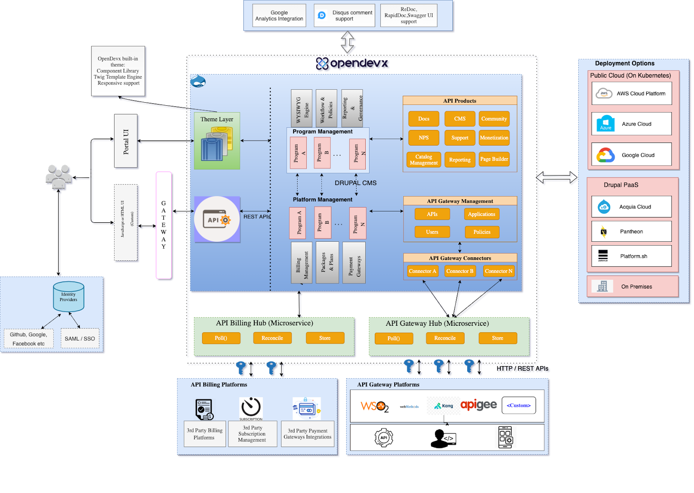
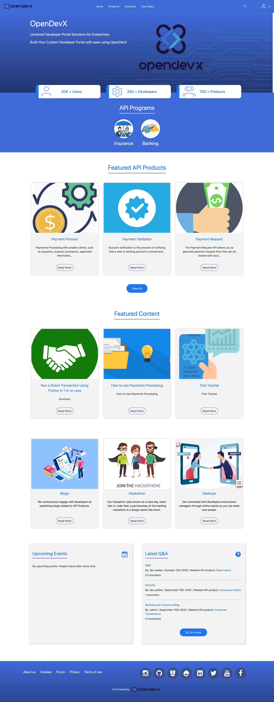

# OpenDevX

OpenDevX is a product framework to build custom developer portals.
Whether you're a SaaS company looking to publish APIs for App developers or a
Financial institution with a sprawling OpenBanking API program,
you can use OpenDevX to engineer a bespoke developer experience.

Some of OpenDevX's most unique features:
- API Program & Product Management with access control
- Fully Customizable Developer Experience & Program Branding
- Connector based architecture (to API gateways & integration systems)
- Developer & Ecosystem Metrics

## Use cases

- **Manage API Products** & Run API programs at scale.
  Get a unified platform that handles product catalog,
  program mangement and governance, while ensuring complete program autonomy.

- Provide Best in Class **Developer Experience** with easy API discovery,
  curated and interactive documentation and resources,
  enterprise and community support and more.

- **Institutionalize Dev Rel** & Developer Marketing.
  Deliver personalized experiences & contextual recommendations based on a
  unified 360 degree dev profile, and increase community
  engagement and developer retention.

- **Monetize, Measure & Monitor** your API program.
  Set & track API Product & Program OKRs/KPIs, including revenue,
  developer engagement & usage goals. Also define rate plans and billing
  models and integrate with existing billing systems.

---

## Architecture



---

## Architecture Key Highlights

- One multi-tenant platform to rule it all = Manage multiple API programs &
  products across multiple gateways under one umbrella
- Plugin based API connector architecture which can be easily extended to
  create new connectors : Gateways, Billing, Workflow Extensions etc
- Open Source: Build on top of Drupal CMS and supports full
  Product Management API lifecycle
- Fully customizable UI support via Drupal Layout builder,
  rich media library, custom themes, text editors etc.
- Any infrastructure: SaaS, PaaS, Public Cloud
- Support for separate HTML or Javascript based frontend
  utilizing the Portal Management Rest APIs

---

## Installation

### Prerequisite ###

```
- PHP >= 7.3
- MySQL >= 5.7
```

OpenDevx utilizes composer to manage its dependencies. So, before using OpenDevX,
make sure you have Composer installed on your machine.

## Installation from source ##
```
git clone git@github.com:srijanone/opendevx.git
cd opendevx
composer install
```

## Installation via Composer Create-Project ##

```
Coming soon. We are in process of building composer command.
```

---


## Features

- Multi-tenancy
  - Multiple Developer Program
  - Customisation at Program Level
  - Custom Domain support for each program
- Different shades of Developer Program
  - Public
  - Private
  - Protected
- Productisation of APsI using various features
  - Guides(Pages)
  - Use Cases
  - FAQs
  - Tutorials
  - Downloads
  - Media
  - Blogs
  - Events
  - Solutions
  - Issues
- Product & API Categorisation
- NPS
- Social Sharing
- Tagging Feature
- Multiple view supported for Open API Specifications
  - Rapidoc
  - Swagger
  - Redoc
- GraphQL Support
- SDK download Support
- User registration with email/Github id/Gmail id
- User Dashboards
- SAML/Github/Gmail login feature supported
- Google Captcha for Authentication
- Forum(For Community Support)
- Issues (Organisational Support)
- Custom Workflows
- Notification(Email & Alerts)
- Search
- Custom pages for branding/marketing
- Custom Connectors

---


## Getting Started


- Open your newly installed portal.



---

[Request for Demo](https://www.opendevx.io/)

## Contribution

- Explore various features of opendevx.
- In case of bug please create issue [here](https://github.com/srijanone/opendevx/issues)

---

## Credits

- Srijan Team (https://srijan.net)

---
